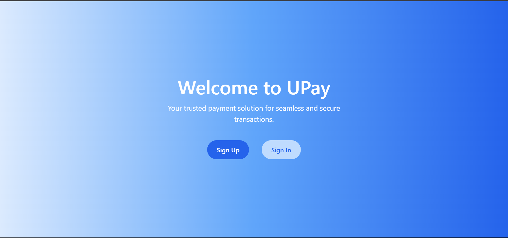
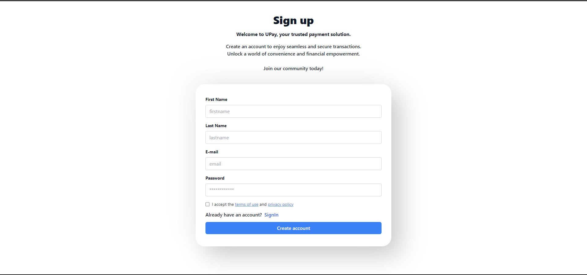
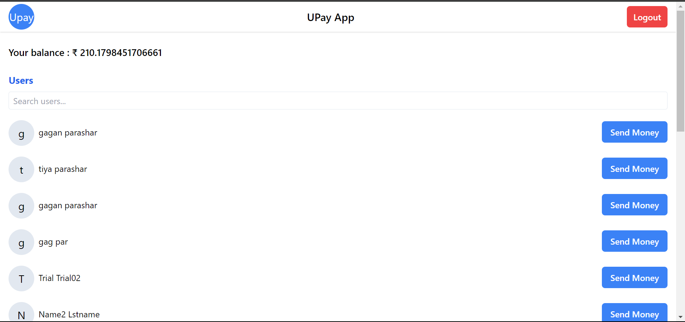
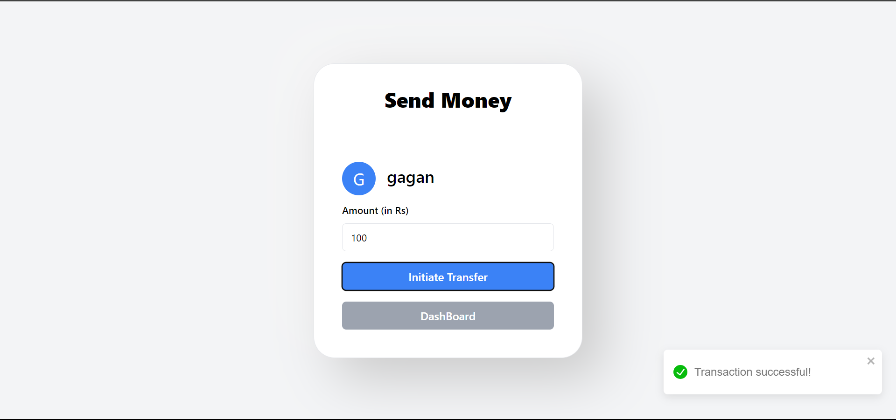

# Upay: Simple Payment Gateway using MERN Stack






## Project Description

Upay is a straightforward payment gateway application developed using the MERN (MongoDB, Express.js, React, Node.js) stack. The application enables users to perform seamless and secure transactions, providing a convenient payment solution.

## Table of Contents

-   [Technologies Used](#technologies-used)
    -   [Frontend](#frontend-libraries)
    -   [Backend](#backend-libraries)
    -   [CSS Framework](#css-framework)
    -   [Build Tool](#build-tool)
-   [Getting Started](#getting-started)
    -   [Prerequisites](#prerequisites)
    -   [Installation](#installation)
    -   [Running the Application](#running-the-application)
-   [Deployment](#deployment)
    -   [Frontend Deployment](#frontend-deployment)
    -   [Backend Deployment](#backend-deployment)
-   [Contributing](#contributing)

## Technologies Used

### Frontend Libraries

### Frontend Libraries

-   [axios](https://www.npmjs.com/package/axios) - Promise-based HTTP client for the browser and Node.js.
-   [react](https://reactjs.org/) - A JavaScript library for building user interfaces.
-   [react-dom](https://reactjs.org/docs/react-dom.html) - Entry point for working with the DOM.
-   [react-router-dom](https://reactrouter.com/web/guides/quick-start) - Declarative routing for React.js.
-   [react-toastify](https://www.npmjs.com/package/react-toastify) - A toast notification library for React.
-   [animate.css](https://animate.style/) - A cross-browser library of CSS animations.

### Backend Libraries

-   [cors](https://www.npmjs.com/package/cors) - Middleware to enable CORS with various options.
-   [dotenv](https://www.npmjs.com/package/dotenv) - Loads environment variables from a `.env` file.
-   [express](https://expressjs.com/) - Web application framework for Node.js.
-   [jsonwebtoken](https://www.npmjs.com/package/jsonwebtoken) - JSON Web Token (JWT) implementation.
-   [mongoose](https://mongoosejs.com/) - MongoDB object modeling tool.
-   [nodemon](https://www.npmjs.com/package/nodemon) - Monitor for changes in your Node.js application and automatically restart the server.
-   [zod](https://www.npmjs.com/package/zod) - Used for input validation on the server-side.

### CSS Framework

-   [Tailwind CSS](https://tailwindcss.com/) - A utility-first CSS framework.

### Build Tool

-   [Vite](https://vitejs.dev/) - A fast build tool that focuses on frontend development.

## Getting Started

Follow the steps below to set up and run the Upay application locally on your machine.

### Prerequisites

Before you begin, make sure you have the following software installed on your system:

-   [Node.js](https://nodejs.org/)
-   [MongoDB](https://www.mongodb.com/try/download/community)

### Installation

1. **Clone the Repository:**

    ```bash
    git clone https://github.com/your-username/upay.git
    cd upay
    ```

2. **Frontend Setup:**

    Navigate to the `frontend` directory:

    ```bash
    cd frontend
    ```

    Install dependencies:

    ```bash
    npm install
    ```

3. **Backend Setup:**

    Navigate to the `backend` directory:

    ```bash
    cd backend
    ```

    Install dependencies:

    ```bash
    npm install
    ```

    Create a `.env` file in the `backend` directory and set the following variables:

    ```dotenv
    PORT=3001
    MONGODB_URI=your-mongodb-string
    JWT_SECRET=your-secret-key
    ```

### Running the Application

1. **Start MongoDB:**

    Ensure that MongoDB is running on your local machine/Mongodb Atlas.

2. **Run Backend Server:**

    In the `backend` directory, start the backend server:

    ```bash
    node index.js

    -if nodemon installed globally
    nodemon index.js
    ```

    The backend server will run on `http://localhost:3001` by default.

3. **Run Frontend Application:**

    In the `frontend` directory, start the frontend application:

    ```bash
    npm run dev
    ```

    The frontend development server will run on `http://localhost:3000`.

    Open your browser and visit `http://localhost:3000` to access the Upay application.

Now you have the Upay application running locally. You can explore the features and functionalities of the payment gateway.

## Deployment

The Upay application is deployed with the frontend hosted on Netlify and the backend on Render.

### Frontend Deployment 
#### Netlify

The Upay frontend is hosted on Netlify. You can access the live application by visiting [Upay - Simple Payment Gateway](https://upay-simple-payment-service.netlify.app/).

Netlify automatically deploys the frontend when changes are pushed to the `main` branch of the GitHub repository. The deployment process is configured through Netlify's continuous integration.

### Backend Deployment 
#### Render

The Upay backend is hosted on Render. The backend server provides the necessary APIs and functionality to support the frontend application.

To access the backend services, you can make API requests to the following base URL: [Backend Base URL]('https://upay-backend.onrender.com')

## Contributing

Thank you for considering contributing to Upay! Please follow these guidelines to make the process smooth and effective:

1. Fork the repository and clone it to your local machine.
2. Create a new branch for your feature or bug fix: `git checkout -b feature-name`.
3. Make your changes and commit them: `git commit -m 'Description of the changes'`.
4. Push to the branch: `git push origin feature-name`.
5. Submit a pull request to the `main` branch of the Upay repository.

### Reporting Issues

If you encounter any issues or have suggestions for improvements, feel free to open an issue on the GitHub repository. Provide a clear and detailed description of the problem or enhancement you're proposing.

We appreciate your contributions and look forward to collaborating with you!
